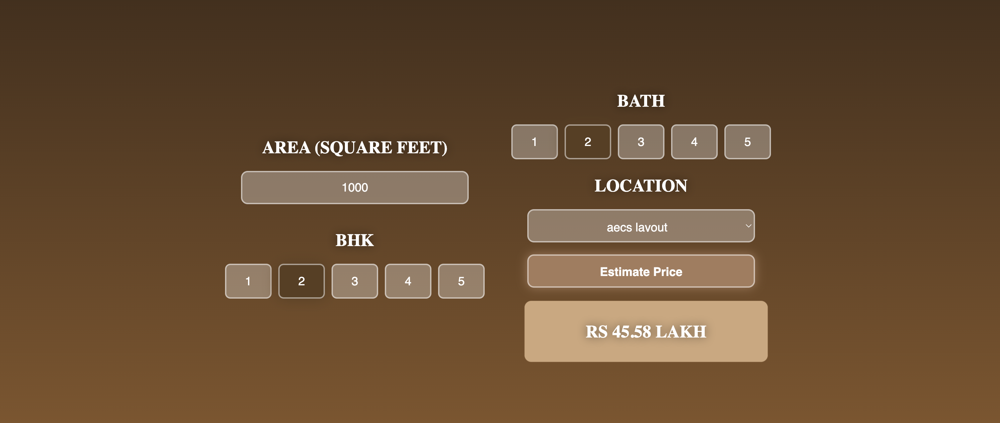

# 🏡 Bengaluru House Price Prediction  

🚀 **Predicting house prices in Bengaluru with machine learning & a web app**  

  

## 📌 Overview  
This project builds an **ML-powered house price prediction model** for Bengaluru. The model is deployed via a **Flask API** and integrated with a **web interface** using HTML, CSS, and JavaScript.  

## 📊 Dataset  
📥 **Source:** [Bengaluru House Price Data](https://www.kaggle.com/datasets/amitabhajoy/bengaluru-house-price-data)  

### 🔍 Workflow  
✅ **Data Cleaning** – Handled missing values, formatted data  
✅ **Outlier Removal** – Improved model accuracy by filtering anomalies  
✅ **Feature Engineering** – Selected key variables for better predictions  
✅ **Model Training & Optimization** – Identified the best ML model  
✅ **Model Export** – Saved the trained model as a `.pkl` file  
✅ **Web App Development** – Built a simple UI using HTML, CSS, and JavaScript  
✅ **Flask API Deployment** – Integrated backend with the web app  

## ⚙️ Tech Stack  
- **Python** (Pandas, NumPy, Scikit-Learn)  
- **Flask** (Backend API)  
- **HTML, CSS, JavaScript** (Frontend UI)  
- **Jupyter Notebook** (Data analysis & model training)  

## 🚀 How to Run  
1️⃣ Clone the repo:  
```bash
git clone https://github.com/SanishCodes/Banglore-Home-Price-Prediction.git
cd Banglore-Home-Price-Prediction
```

2️⃣ Install Dependencies
```bash
pip install -r requirements.txt
```

3️⃣ Run the Flask Server
```bash
python server.py
```

4️⃣ Open the Web App
- Open app.html in your browser.
- Enter the required details to predict house prices in Bengaluru.

## 📸 Preview  


## 🤝 Contributing
Feel free to fork this repo, create a pull request, or open an issue!

🚀 Happy coding!
